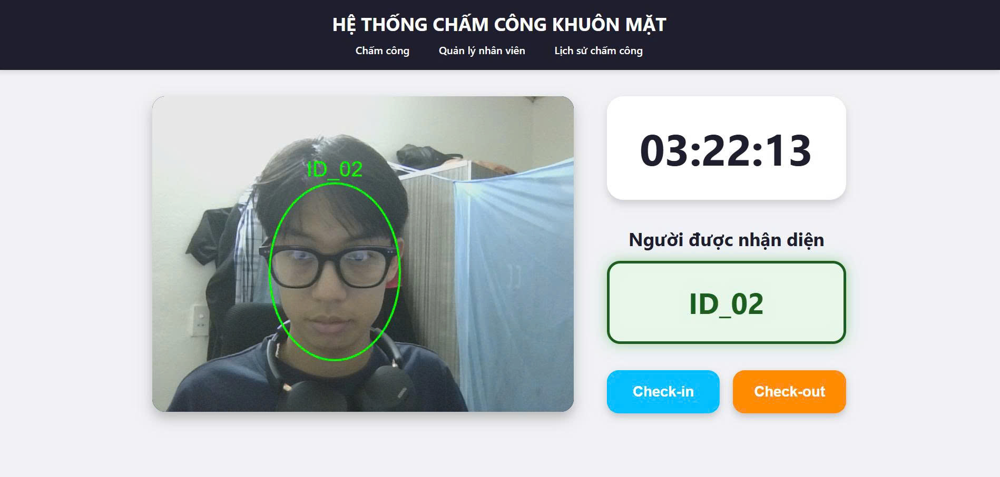

# Gender and Age Recognition system
Gender and Age Recognition System automatically detects faces and predicts gender and age from images, videos, and real-time webcam streams using deep learning models.

## Table of Contents

- [Installation](#installation)
- [Usage](#usage)
- [Demo](#demo)
- [License](#license)

## Installation

Make sure you have **Python 3.9** installed. Then install the required dependencies and start the server using the following commands:

1. Clone the repository

```bash
git clone https://github.com/HieuNguyen2910/Gender_and_Age_Recognition
cd Gender_and_Age_Recognition
```

2. Create and activate Conda environment

```bash
conda create -n agegender python=3.9 -y
conda activate agegender
```

3. Install required dependencies
```bash
pip install -r requirements.txt
```

## Usage

Download the pretrained model weights and place them into the appropriate directory (`weights/`).

🔗 **Weights download link:**  
*(https://drive.google.com/drive/u/8/folders/1v_1ODG5t86MGQYO3lt52oUXXec8xOo7g)*

Make sure the file paths in the source code match the downloaded weights.

Run the Django Development Server
```bash
python manage.py runserver
```

Access the Web Application: 
open your browser and go to 
*(http://127.0.0.1:8000/)*

## Demo

Below is an example of gender and age prediction on a sample image.




